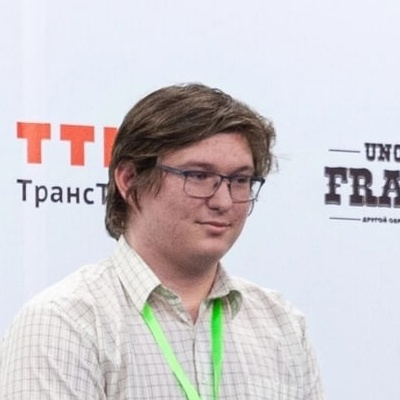
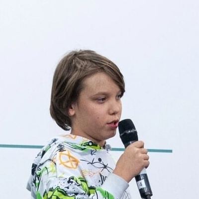

# Hackathon Autumn 2023

Здесь представляется решение кейса от компании ВебПрактик
`Веб приложение для сервиса публикации статей` командой RoboGradeIndustriesTeam.

# Frontend

Фронтенд: [клацк](https://github.com/nosqd/HackathonFall2023Web)

# Команда

# Установка
Процесс установки описан [здесь](./doc/install.md)